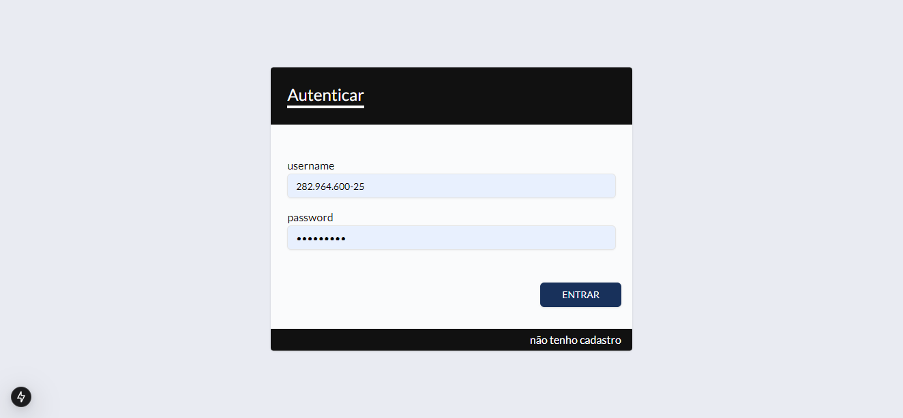
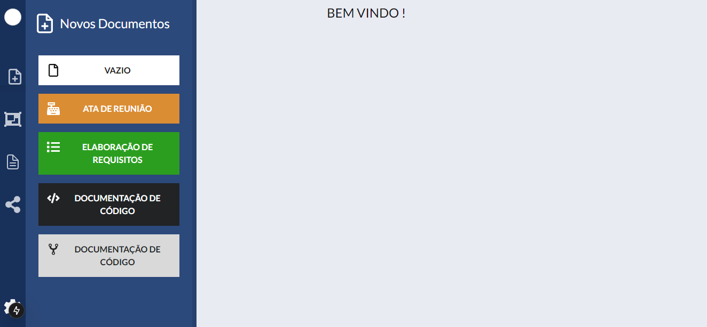
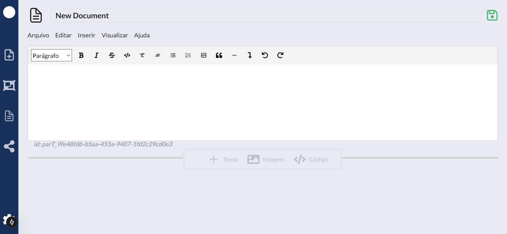
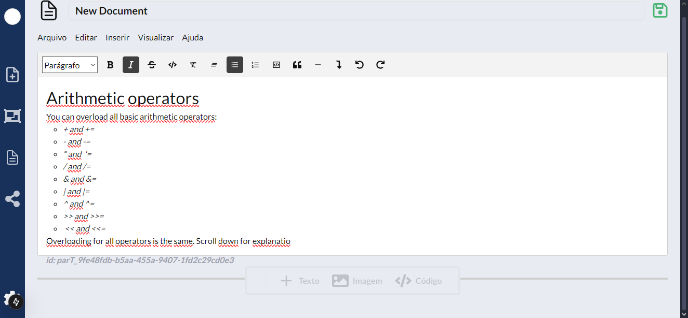
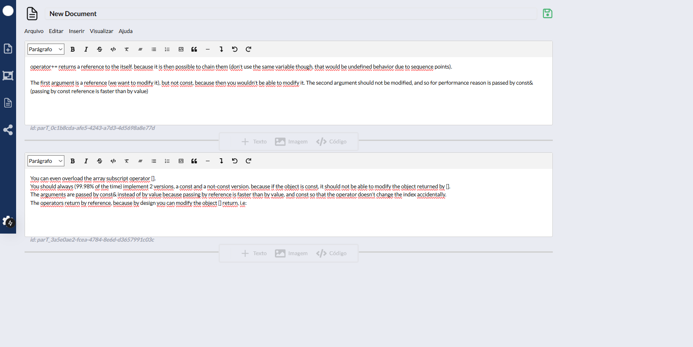

# ok

application of project documentation in a simple way where we can create documents, relating them to each other

* can create documents and mention another 

By doing this, dividing the document into sessions I can interrelate these sessions, making the document more dynamic.
#### login page

#### create document

#### new document

#### editing document

#### editing sessions document

## released:

|versions| description |
|--|--|
| v1.0.0 |create document and add session of document|